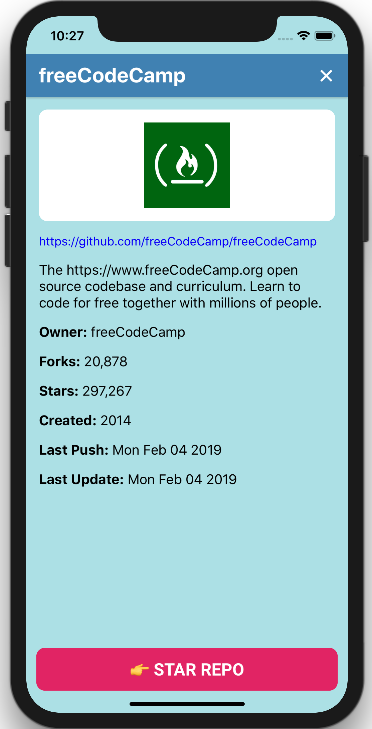

[](http://makeapullrequest.com)
[](https://opensource.org/licenses/MIT)
[](https://github.com/airbnb/javascript)

# githubber

**githubber** is a small sample app written in react-native, which uses Github's GraphQL API as a backend and performs some basic queries and mutations using apollo-client.

## Tech Stack

- ⚛️ react-native
- 🚀 apollo-client
- 💅 styled-components
- ✅ jest

## Key Features

- [x] Support for building native code
- [x] Styling using [styled-components](https://www.styled-components.com/docs/basics#react-native)
- [x] In-app navigation/routing handled via [react-navigation](https://reactnavigation.org/)
  - creating a stack navigator
  - navigation between screens, passing parameters to routes
  - configuring the header bar
- [x] Remote data managed using [apollo-client](https://www.apollographql.com/docs/react/recipes/react-native.html)
  - queries: get first 10 repositiories by language
  - mutations: star a repository
- [x] Local data also managed by apollo-client using [apollo-link-state](https://www.apollographql.com/docs/react/essentials/local-state.html)
  - store user language selection in Apollo cache
- [x] Offline support using [apollo-cache-persist](https://github.com/apollographql/apollo-cache-persist)
  - language selection is persisted
  - repositories list can be viewed while offline
- [ ] Unit tests with [jest](https://jestjs.io/docs/en/tutorial-react-native)

## Environment

This app was developed following the steps in the react-native docs - ["Building projects with native code"](https://facebook.github.io/react-native/docs/getting-started.html). Env setup:

```
Environment:
  Node: 9.4.0
  Yarn: 1.3.2
  npm: 5.6.0
  Watchman: 4.9.0
  Xcode: 9.2/9C40b - /usr/bin/xcodebuild
  Android Studio: 3.2 AI-181.5540.7.32.5056338
```

## Getting Started

To communicate with the GraphQL server, you'll need an OAuth token with the right scopes. Follow the steps in ["Creating a personal access token for the command line"](https://help.github.com/articles/creating-an-access-token-for-command-line-use/) to create a token. After getting a token, follow these steps to start the app:

```
$ git clone https://github.com/emimuresan/githubber.git
$ cd githubber && touch .env
$ echo "GITHUB_TOKEN=<your token here>" > .env
$ yarn install
$ yarn ios OR yarn android
```

## Available Scripts

- `yarn ios` - start the app in the iOS simulator
- `yarn android` - start the app in the Android emulator
- `yarn lint` - runs eslint checks + fixes
- `yarn test` - runs available unit tests

## Screenshots



